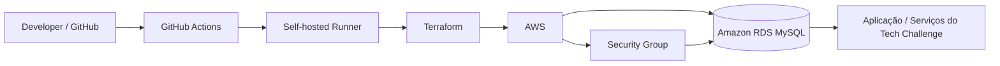

# Tech Challenge Infra - RDS

## Propósito

Este repositório provisiona a infraestrutura de banco de dados relacional da solução Tech Challenge na AWS, com foco em um instância MySQL gerenciada pelo Amazon RDS e um Security Group que permite a conexão apenas dos serviços autorizados da arquitetura (por exemplo, EKS e Lambda).

A responsabilidade principal deste módulo é manter a camada de dados isolada, versionada e automatizada via Terraform, deixando a base de dados pronta para os demais repositórios da aplicação consumirem suas credenciais e endpoint.

## Tecnologias

- Terraform
- AWS Provider para Terraform
- Amazon RDS para MySQL 8.0
- AWS VPC, sub-redes e Security Groups
- AWS S3 como backend remoto do estado
- GitHub Actions com self-hosted runner
- AWS CLI

## Pré-requisitos

Antes de executar este projeto, certifique-se de que:

- Você tenha acesso à conta AWS com permissões para criar RDS, SG, subnet group e consultar IAM.
- O bucket S3 do backend remoto já exista e esteja configurado.
- A VPC, sub-redes e Security Group de origem já estejam disponíveis.
- O runner auto-hospedado do GitHub esteja registrado e autenticado para a AWS.
- O Terraform esteja instalado localmente.
- O AWS CLI esteja configurado com credenciais válidas.

## Estrutura do repositório

- [src/main.tf](src/main.tf): definição da infraestrutura principal do RDS.
- [src/variables.tf](src/variables.tf): variáveis configuráveis do módulo.
- [.github/workflows/deploy-aws.yml](.github/workflows/deploy-aws.yml): pipeline de validação e deploy.
- [src/README.md](src/README.md): documentação técnica do módulo Terraform.

## Execução local

A partir da raiz do projeto:

```bash
cd src
terraform init
terraform plan -var "db_password=<sua_senha>" -out=tfplan
terraform apply tfplan
terraform output -raw rds_endpoint
terraform output -raw rds_security_group_id
```

Se quiser validar sem aplicar:

```bash
terraform validate
terraform fmt -check -recursive
```

## Deploy

O deploy é automatizado pela pipeline definida em [.github/workflows/deploy-aws.yml](.github/workflows/deploy-aws.yml).

### Fluxo de deploy

1. Push em branches de feature dispara a etapa de validação.
2. Pull request para main executa validação do Terraform.
3. Push para main dispara `plan` e `apply` no self-hosted runner.
4. O workflow também pode ser acionado manualmente via `workflow_dispatch`.
5. O ambiente `production` pode exigir aprovação manual antes do apply final.

## Pipeline explicada

### Etapas da pipeline

- `validate`
  - verifica o checkout do código
  - instala o Terraform
  - executa `terraform init` sem backend
  - valida formatação com `terraform fmt -check -recursive`
  - confirma a configuração com `terraform validate`

- `open-pr`
  - abre automaticamente o pull request quando a branch de feature é enviada

- `deploy`
  - executa em `main` ou via execução manual
  - autentica no AWS com o runner
  - roda `terraform init`, `plan` e `apply`

### Variáveis e segredos recomendados

- `AWS_REGION`: região da AWS; padrão `us-east-1`
- `TF_VAR_db_password` ou equivalente configurado no ambiente do runner
- ambiente `production` com aprovação manual, se desejado

> O estado do Terraform contém dados sensíveis, então o bucket do backend deve estar protegido por criptografia, versionamento e políticas de acesso restritas.

## Diagrama do componente



## Swagger / Postman

Este repositório não expõe uma API HTTP pública nem documentação de endpoints. Ele provisiona apenas infraestrutura de banco de dados.

Se a aplicação backend tiver uma API REST, a documentação de Swagger/OpenAPI ou Postman deve ser consultada no repositório correspondente da aplicação, por exemplo:

- Swagger/OpenAPI: adicionar o link do serviço backend
- Postman: adicionar a coleção pública do projeto

## Observações de produção

- Habilitar `deletion_protection` em ambientes críticos.
- Ativar snapshot final e backups de forma consistente com a política de recuperação.
- Restringir o Security Group somente ao tráfego necessário.
- Manter o bucket do backend remoto protegido e com versionamento ativo.
- Revisar permissões da role IAM usada pelo runner.

## Referência rápida

```bash
terraform init
terraform plan -var "db_password=<senha>" -out=tfplan
terraform apply tfplan
terraform output -raw rds_endpoint
```
