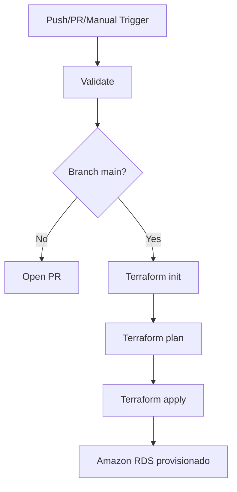
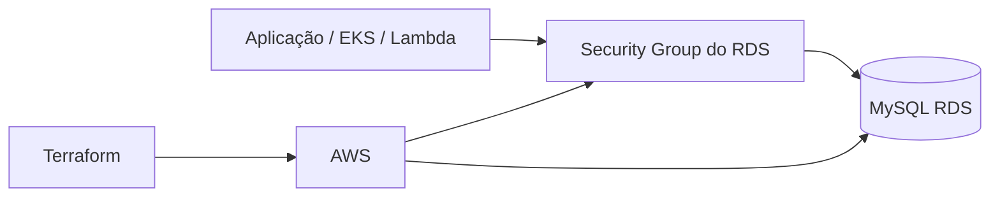

# Módulo Terraform - RDS MySQL

## Propósito

Este módulo provisiona uma instância de banco de dados MySQL na AWS usando Amazon RDS, com controle de acesso por Security Group e integração com a VPC do ambiente do Tech Challenge.

O objetivo do módulo é centralizar a criação do banco principal do projeto, garantindo que os demais serviços consigam se conectar ao banco de forma segura e controlada.

## Tecnologias

- Terraform
- HashiCorp AWS Provider
- Amazon RDS
- Amazon VPC e Security Groups
- AWS S3 para backend remoto
- GitHub Actions

## Pré-requisitos

- Terraform instalado e configurado. 
- AWS CLI autenticado.
- Permissões para criar RDS, SG, subnet groups e consultar a VPC.
- VPC, sub-redes e Security Group de origem já existentes.
- Bucket S3 do backend previamente criado.

## Variáveis principais

- `aws_region`: região da AWS (padrão `us-east-1`)
- `vpc_id`: identificador da VPC
- `subnet_ids`: lista de sub-redes para o banco
- `client_security_group_id`: SG dos serviços que podem acessar o banco
- `db_name`: nome do banco
- `db_username`: usuário admin do MySQL
- `db_password`: senha do banco

## Execução local

```bash
cd src
terraform init
terraform plan -var "db_password=<sua_senha>" -out=tfplan
terraform apply tfplan
terraform output -raw rds_endpoint
terraform output -raw rds_security_group_id
terraform output -raw rds_identifier
```

## Deploy

O deploy é realizado pela pipeline em [.github/workflows/deploy-aws.yml](../.github/workflows/deploy-aws.yml).

### Fluxo principal

1. A validação ocorre em feature branches e PRs.
2. O runner conecta na AWS e executa `terraform init`.
3. O Terraform realiza `plan` e `apply` quando o código é enviado para `main`.
4. Os outputs do banco são expostos para consumo pelos demais módulos e pipelines.

## Explicação da pipeline

A pipeline foi montada em etapas de qualidade e entrega:

- `validate`: valida sintaxe, formatação e consistência do Terraform.
- `open-pr`: cria pull request automaticamente para branches de feature.
- `deploy`: aplica a infraestrutura em produção no self-hosted runner com autenticação AWS.

A pipeline usa a seguinte lógica:



## Diagrama do componente



## Segurança e boas práticas

- Use backend remoto com S3 para controle do estado.
- Ative criptografia no bucket e no banco.
- Mantenha `publicly_accessible` como `false`.
- Restrinja o Security Group ao tráfego necessário.
- Evite armazenar senha no código-fonte; use variáveis/segredos do ambiente.
- Em produção, considere `deletion_protection` e snapshots automáticos.

## Swagger / Postman

Este módulo não expõe endpoints HTTP, então não há Swagger nem coleção de Postman específicos para este repositório.

Se a aplicação backend tiver documentação REST, os links devem ser mantidos no repositório da API responsável. Este projeto é apenas de infraestrutura de dados.

## Saída útil

Após o apply, os outputs mais relevantes são:

- `rds_endpoint`
- `rds_port`
- `rds_security_group_id`
- `rds_identifier`

Esses valores devem ser repassados aos outros componentes da solução.
